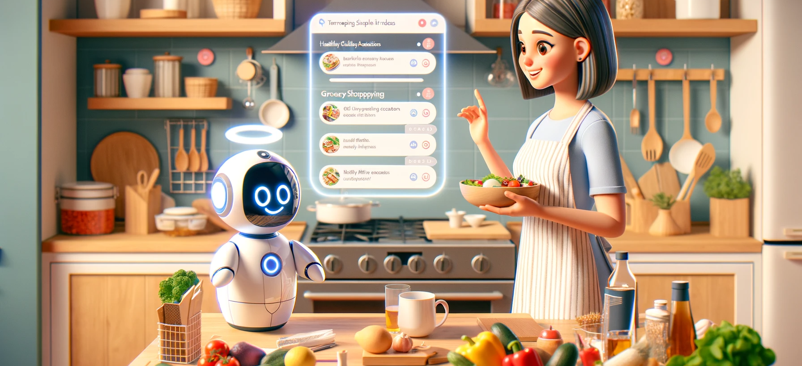
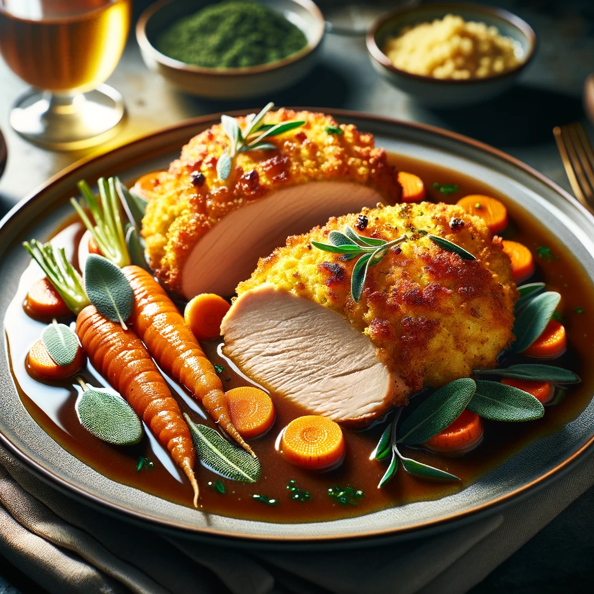

# Craft Your Own Kitchen Companion: Leveraging OpenAI Assistant, Image Generation, and Text-to-Speech for a Revolutionary Cooking Experience 
   

## TL;DR
 OpenAI unveiled its [Assistant API](https://platform.openai.com/docs/assistants/overview) during its very first developer conference-[OpenAI DevDay](https://devday.openai.com/). This marked a significant addition to the suite of tools and models available for building conversational AI, a domain in which I've been actively engaged. 
 
 Although I have used other frameworks, tools and models to build customized Assistant in the past (check out my previous posts  [Food QnA Chatbot : Help Answer Food Related Questions from Your Own Cookbook](https://bearbearyu1223.github.io/chatbot/2023/07/31/food-qna-on-server-llm.html) and [Build On-Device QnA with LangChain and Llama2](https://bearbearyu1223.github.io/chatbot/2023/08/14/food-qna-on-device-llm.html)), intrigued by the new capabilities of the Assistant API, I decided to integrate it into a new project. This sample project is a refreshed demonstration of a simple Cooking Assistant, leveraging not only the Assistant API but also incorporating additional functionalities such as [Text-to-Speech](https://platform.openai.com/docs/guides/text-to-speech) and [Image Generation](https://platform.openai.com/docs/guides/images?context=node), showcasing a holistic approach to building conversational AI systems with only a few lines of code. 
 
Get inspired by the latest from Open AI DevDay with my project on [](https://github.com/bearbearyu1223/assistant_api_playground)? Ready to unleash your creativity? Start building your own generative AI-powered experience today, join the forefront of AI innovation, and let us make AI for everyone! 

## Set Up the Dev Enviroment 
* Step 1: Git clone the sample project from [](https://github.com/bearbearyu1223/assistant_api_playground). 
* Step 2: Create a venv
```
python3 -m venv cooking_assistant
```
* Step 3: Under the project root, active the venv you have just created,
```
source cooking_assistant/bin/activate
```
* Step 4: Installed the required libaries in the venv 
```
pip3 install -r requirements.txt
```
* Step 5: create an `.env` file under your project root and add your Open AI API Key as following: 
```
OPENAI_API_KEY=<Your API KEY>
```

## Run the Application 
You can play with the project in an interactive mode by entering a query related to food preparation and cooking via:
```
python main.py
```
and simply press `Ctrl + C` to exit the program. 

Also see a sample converstation below: 
| **Turn ID**      	| **User Query**                                                                                                                                  	| **Assistant    Response** 	        |
|----------	|-------------------------------------------------------------------------------------------------------------------------------------------------	|------------------------	|
|     Turn 0     	| 👩🏻‍🍳: Hi there, Thanksgiving is coming!<br>I would like to have some ideas for cooking!                                                          	| 🔮 tts playback 0  <video src="https://github.com/bearbearyu1223/assistant_api_playground/assets/7468124/e3c82408-aa4b-4b25-85ce-a2c35414bb18" controls="controls"> </video>      	|
|     Turn 1     	| 👩🏻‍🍳: Yes, please                                                                                                                                	| 🔮 tts playback 1 <video src="https://github.com/bearbearyu1223/assistant_api_playground/assets/7468124/4388d450-2fbe-4de4-8cb5-c432a4a6c989" controls="controls"> </video>       	|
|     Turn 2     	| 👩🏻‍🍳: How does the cornbread crusted turkey looks like?                                                                                          	| 🔮 tts playback 2 <video src="https://github.com/bearbearyu1223/assistant_api_playground/assets/7468124/3b97f276-e739-4f9b-8676-e0af88e25e0e" controls="controls"> </video>      	|
|          	|    See the visual representation generated by the Assistant bellow:                                                                                                                                             	                                     	||
|     Turn 3     	| 👩🏻‍🍳: That is nice! And how to make cornbread?                                                                                                  	| 🔮 tts playback 3 <video src="https://github.com/bearbearyu1223/assistant_api_playground/assets/7468124/e2b30daf-d11a-4d0b-96b5-7e0dabeb012a" controls="controls"> </video>        	|
|    Turn 4     	| 👩🏻‍🍳: No, actually, can you create a grocery list for me, <br>including the recipes for the cornbread crusted turkey <br>and also the cornbread?  	| 🔮 tts playback 4 <video src="https://github.com/bearbearyu1223/assistant_api_playground/assets/7468124/ccaf9d52-041c-4b96-8a23-674d94aa489d" controls="controls"> </video>       	|


