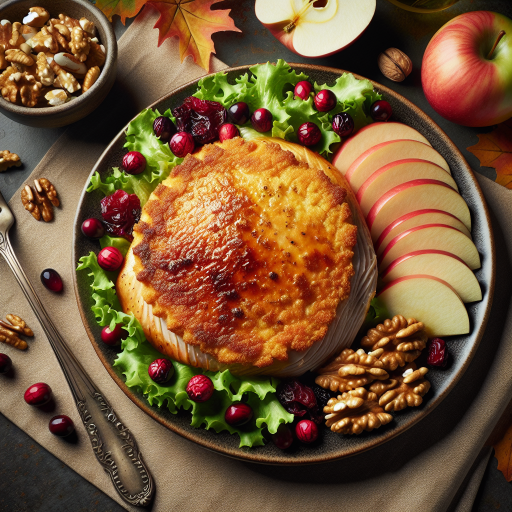

| Turn ID | User Query | Assistant Response | TTS Playback |
|---------|------------|--------------------|--------------|
| Turn 0  | 👩🏻‍🍳: Hi there, Thanksgiving is coming! I would like to have some ideas for cooking! | 🔮: Thanksgiving is a great occasion to prepare a feast. Here are some main dish ideas inspired by the contents of the "Deliciously Healthy Dinners" cookbook that could suit a Thanksgiving dinner: <li>1. **Poultry:** - Moroccan Chicken Stew with Couscous - Thai-Style Chicken Curry - Sweet-and-Sour Chicken - Chicken Quesadillas with Red and Green Salsa - Oven-Crusted Chicken Breast - Cornbread-Crusted Turkey - Turkey Club Burger - Turkey Mole - 20-Minute Chicken Creole</li> </li><li>2. **Beef:** - Cocoa-Spiced Beef Tenderloin with Pineapple Salsa - Greek-Style Flank Steak with Tangy Yogurt Sauce - Stir-Fried Orange Beef - Mediterranean Kabobs - Beef Steak with Carrots and Mint - Broiled Sirloin with Spicy Mustard and Apple Chutney </li><li>3. **Seafood:** - Grilled Tuna with Chickpea and Spinach Salad - Baja-Style Salmon Tacos - Spanish-Style Shrimp Stew - Baked Red Snapper with Zesty Tomato Sauce - Asian-Style Steamed Salmon - Baked Salmon Dijon </li><li>4. **Pork:** - Pork Mignons with French Applesauce - Pork Chops in Warm Cherry Sauce - Grilled Pork Tenderloin with Asian Sauce </li><li>5. **Vegetarian Main-Dish Meals:** - Tuscan Beans with Tomatoes and Oregano - Caribbean Casserole - Red Beans and Rice - Corn and Black Bean Burritos - Lentils with Brown Rice and Kale - Edamame Stew</li> If you want a specific recipe from any of the above options or need side dish suggestions, please let me know! | TODO |
| Turn 1  | 👩🏻‍🍳: How to make Cornbread-Crusted Turkey? | 🔮: Here's a recipe I found for Cornbread-Crusted Turkey from your cookbook【13†source】: <ul>- Prep Time: 20 minutes - Cook Time: 20 minutes</ul> Ingredients: <ul><li>- 1 cup low-fat buttermilk </li><li>- 1 tablespoon Dijon mustard </li><li>- 4 skinless turkey fillets (3 oz each) </li><li>- 4x4-inch square prepared cornbread (about 1 cup crumbs) (refer to Good-for-You Cornbread recipe) </li><li>- 1 egg white (or substitute liquid egg white) </li><li>- 1 cup low-sodium chicken broth </li><li>- 1 tablespoon cornstarch </li><li>- 1 pound frozen baby carrots </li><li>- 1 tablespoon fresh sage, rinsed, dried, and chopped (or 1 teaspoon dried) </li><li>- 1 tablespoon butter</li></ul> Instructions: <ul><li>1. Preheat oven to 350°F. </li><li>2. Mix buttermilk and Dijon mustard in a bowl. </li><li>3. Marinate turkey fillets in the mixture for 5–10 minutes while preparing cornbread. </li><li>4. Grind cornbread to make coarse crumbs. Dry on a baking sheet in a 300°F oven for 4–5 minutes without browning. </li><li>5. Put dry breadcrumbs and egg white in separate dishes.</li><li> 6. Dip each turkey fillet in egg white, then cornbread crumbs to coat, discarding excess. </li><li> 7. Place breaded turkey on a baking sheet and bake for 10–15 minutes until internal temperature reaches 165°F. </li><li>8. For the sauce, combine chicken broth, cornstarch, carrots, sage, and butter in a saucepan. Boil, then simmer for about 5 minutes until the sauce thickens and carrots warm up. </li><li>9. Serve each turkey fillet with a cup of carrots and sauce.</li> </ul> Yield: <ul>4 servings - Serving Size: 3 oz turkey, 1 cup carrots, and sauce mixture</ul> Tip: <ul>Serve with a baked or roasted sweet potato for a complete meal.</ul> | TODO |
| Turn 2  | 👩🏻‍🍳: Thanks, what kind of salad will pair nicely with it? | 🔮: An Autumn Salad would pair nicely with Cornbread-Crusted Turkey. Here's the recipe from your cookbook【19†source】: - Prep Time: <ul>10 minutes</ul> - Cook Time: <ul>0 minutes</ul> Ingredients: <ul><li>- 1 Granny Smith apple, rinsed and thinly sliced (with skin) </li><li>- 2 tablespoons lemon juice </li><li>- 1 bag mixed lettuce greens (or your favorite lettuce), about 5 cups, rinsed </li><li>- 1/2 cup dried cranberries </li><li>- 1/4 cup walnuts, chopped </li><li>- 1/4 cup unsalted sunflower seeds </li><li>- 1/3 cup low-fat raspberry vinaigrette dressing</li></ul> Instructions: <ul> <li>1. Sprinkle lemon juice on the apple slices. </li><li>2. In a large bowl, combine the lettuce, cranberries, apple slices, walnuts, and sunflower seeds. </li><li>3. Toss the salad with the raspberry vinaigrette dressing to lightly coat the ingredients.</ul></ul> Yield: <ul>6 servings</ul> Serving Size: <ul>1 cup salad This salad, with its mix of fruit and nuts, is a flavorful and seasonal side that complements the savory turkey nicely. | TODO |
| Turn 3  | 👩🏻‍🍳: Can I see a visual of the autumn salad with the cornbread crusted turkey? | 🔮: Absolutely! Prepare for a delightful visual preview of the recipe, coming up shortly. Please hold on! For the visual prompt of the Autumn Salad with the Cornbread-Crusted Turkey:<ul> <li>- Envision a warm, inviting plate centered with a golden-brown Cornbread</li><li>-Crusted Turkey fillet, its crunchy exterior hinting at the tender, juicy meat within.</li><li> - Next to it lies a vibrant and colorful Autumn Salad, a bed of mixed lettuce greens punctuated by the bold reds of dried cranberries and the crisp green of thinly sliced Granny Smith apples. </li><li>- Scattered on top are earthy, chopped walnuts and the delicate shimmer of unsalted sunflower seeds, offering both texture and taste. </li><li>- The salad glistens lightly, dressed in a delicate sheen of low-fat raspberry vinaigrette, complementing the robust flavors of the turkey. </li><li>- The plate is a harmonious blend of the heartiness of Thanksgiving and the freshness of autumn, a celebration of both comfort and zest on the palate.</li></ul> | TODO |
|         |            |                     |              |
| Turn 4  | 👩🏻‍🍳: Oh that is very nice. How many calories per serving, including the autumn salad and the cornbread crusted turkey? | 🔮: The combined total calories per serving for the Autumn Salad and the Cornbread-Crusted Turkey is 395 calories. | TODO |
| Turn 5  | 👩🏻‍🍳: Can you give me a breakdown of how the total calories per serving is calculated? | 🔮: Certainly! Here's the breakdown of how the total calories per serving is calculated for the combination of Autumn Salad and Cornbread-Crusted Turkey: **Autumn Salad:** <ul>- Calories per serving: 138 </ul>**Cornbread-Crusted Turkey:**<ul> - Calories per serving: 257 </ul>To find the total calories for one serving of both the salad and the turkey,  we add the calories of one serving of salad to the calories of one serving of turkey: <ul>**Total Calories per Serving = Calories from Salad + Calories from Turkey** </ul>Thus: <ul>**Total Calories per Serving = 138 + 257** </ul>When we add those two numbers together, we get the total calories for one serving: <ul>**Total Calories per Serving = 395**</ul> This calculation takes into account one serving of each dish, as defined by the cookbook. | TODO |
| Turn 6  | 👩🏻‍🍳: Nice. Can you help me create a grocery list for making the autumn salad and the cornbread crusted turkey? | 🔮: Absolutely, here's your grocery list for making the Autumn Salad and the Cornbread-Crusted Turkey: **For the Autumn Salad:** <ul><li>- 1 Granny Smith apple - Lemon juice (at least 2 tablespoons) </li><li>- Mixed lettuce greens or your favorite lettuce (1 bag, about 5 cups) - Dried cranberries (½ cup) </li><li>- Walnuts (¼ cup, chopped)</li><li> - Unsalted sunflower seeds (¼ cup) </li><li>- Low-fat raspberry vinaigrette dressing (⅓ cup)</li></ul> **For the Cornbread-Crusted Turkey:**<ul> <li>- Low-fat buttermilk (1 cup) </li><li>- Dijon mustard (1 tablespoon) </li><li>- Skinless turkey fillets (4 fillets, 3 oz each) </li><li>- Prepared cornbread (4x4-inch square, about 1 cup crumbs) </li><li>- Egg white or liquid egg white (1 egg's worth) </li><li>- Low-sodium chicken broth (1 cup) </li><li>- Cornstarch (1 tablespoon) </li><li>- Frozen baby carrots (1 pound) </li><li>- Fresh sage (1 tablespoon, chopped) or dried sage (1 teaspoon) </li><li>- Butter (1 tablespoon)</li></ul> **Pantry staples (check to ensure you have these on hand):** <ul><li>- Cooking oil or cooking spray (for baking the turkey) </li><li>- Salt and pepper (to taste, not listed in the cookbook recipe but typically used in cooking)</li></ul> **Optional:** <ul><li>- Sweet potato, if you wish to follow the serving tip provided with the turkey recipe.</li></ul> Before shopping, check your kitchen to see if you have any of these ingredients already to avoid duplicates. Happy cooking and enjoy your Thanksgiving feast! | TODO |
| Turn 7  | 👩🏻‍🍳: Thank you! Happy Thanksgiving! | 🔮: You're welcome! If you need any more help in the future, feel free to reach out. Have a wonderful Thanksgiving and enjoy your delicious meal! | TODO |
